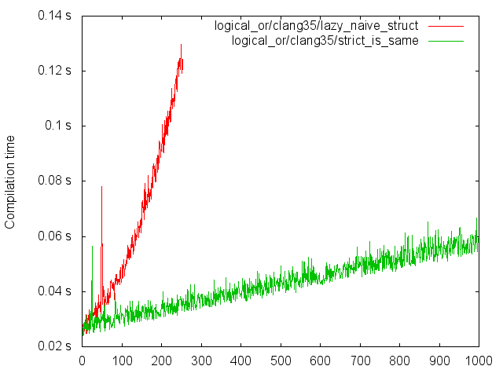
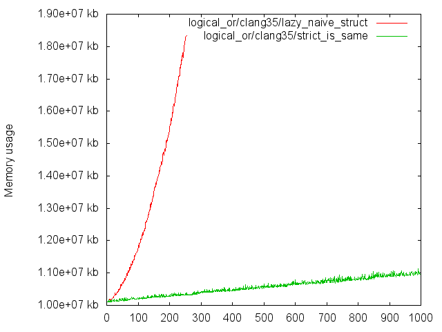
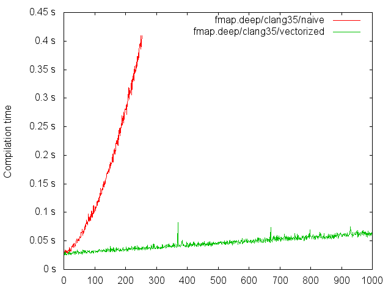
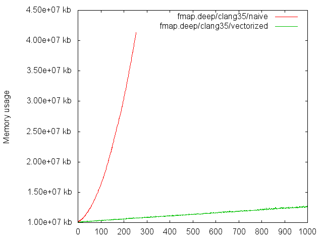
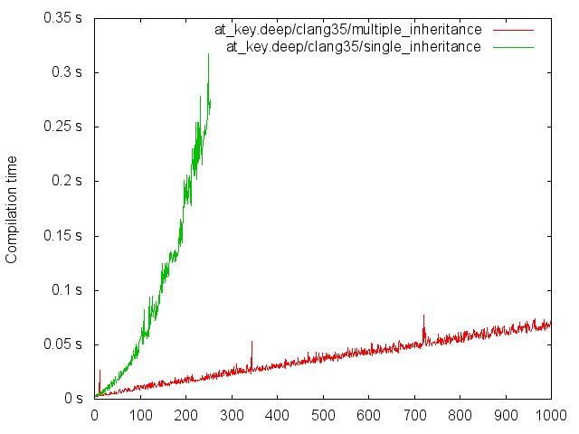
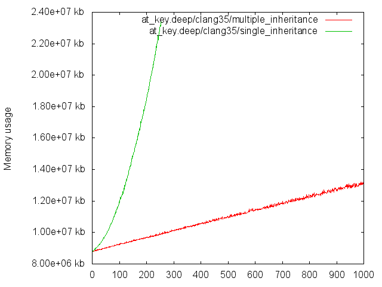
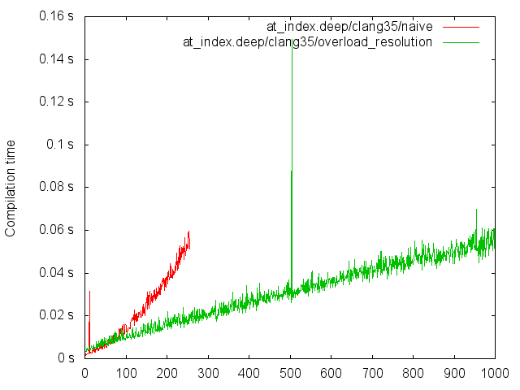
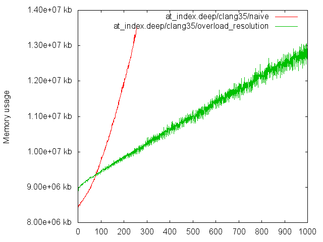
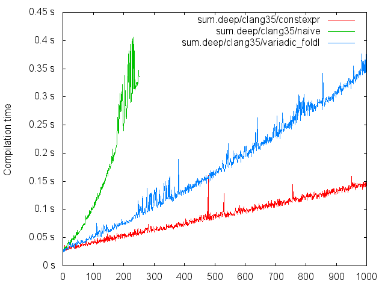
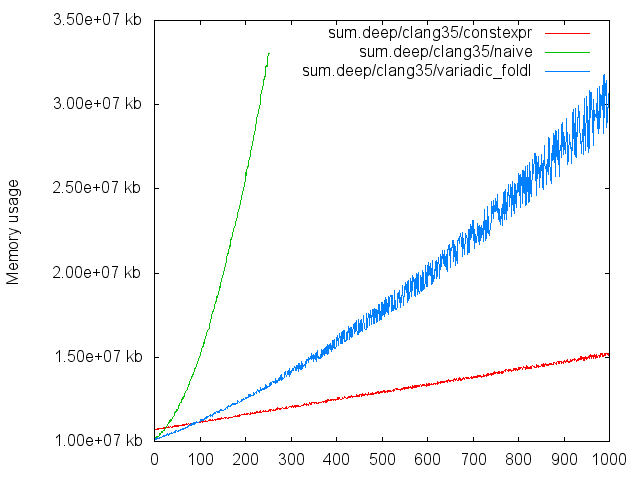

## Towards painless metaprogramming
### Louis Dionne, C++Now 2014

====================

## Outline
- Metaprogramming in C++1y
- Towards a MPL successor: state of affairs

==============================================================================

# Act 1
## Metaprogramming in C++1y

====================

## Boilerplate for this section

Note:
Explain that in the examples, we're not using lifted metafunctions for
simplicity, but their utility will be explained. They are useful beyond the
lack of universal template template parameters in c++03: we can't parse
lambda expressions if they don't contain type template parameters only
(IS THAT TRUE?).

----

```cpp
#include <array>
#include <cstddef>
#include <functional>
#include <type_traits>
```

----

```cpp
template <bool v>
using bool_ = std::integral_constant<bool, v>;

using true_ = bool_<true>;
using false_ = bool_<false>;
```

----

```cpp
template <typename ...xs>
struct list;

template <typename x, typename xs>
struct cons;

template <typename x, typename ...xs>
struct cons<x, list<xs...>> {
    using type = list<x, xs...>;
};
```

----

```cpp
template <typename xs>
struct tail;

template <typename x, typename ...xs>
struct tail<list<x, xs...>> {
    using type = list<xs...>;
};
```

----

```cpp
template <typename xs>
struct head;

template <typename x, typename ...xs>
struct head<list<x, xs...>> {
    using type = x;
};
```

----

```cpp
template <typename xs>
struct is_empty;

template <typename ...xs>
struct is_empty<list<xs...>>
    : bool_<sizeof...(xs) == 0>
{ };
```

Note:
Explain how this setup with `list` is equivalent to an iterator-based
setup in the MPL, only simpler.

====================

## Logical operations
(without short-circuiting)

<!-- TEST CODE
static_assert(and_<>::value, "");
static_assert(!and_<false_>::value, "");
static_assert(and_<true_>::value, "");
static_assert(!and_<true_, false_>::value, "");
static_assert(and_<true_, true_>::value, "");
static_assert(!and_<true_, true_, true_, true_, true_, false_>::value, "");
-->

----

Naive
```cpp
template <typename ...xs>
struct and_ : true_ { };

template <typename x, typename ...xs>
struct and_<x, xs...>
    : std::conditional_t<x::value, and_<xs...>, x>
{ };
```

<!--
~~~~

With `noexcept`
```cpp
void allow_expansion(...) noexcept;

template <bool condition>
struct noexcept_if { noexcept_if() noexcept(condition) { } };

template <typename ...xs>
using and_ = bool_<
    noexcept(allow_expansion(noexcept_if<xs::value>{}...))
>;
```

~~~~

With `constexpr`
```cpp
template <std::size_t N>
constexpr bool and_impl(const bool (&array)[N]) {
    for (bool elem: array)
        if (!elem)
            return false;
    return true;
}

template <typename ...xs>
using and_ = bool_<
    and_impl<sizeof...(xs) + 1>({(bool)xs::value..., true})
>;
```

~~~~

With overload resolution
```cpp
template <typename ...T> true_  pointers_only(T*...);
template <typename ...T> false_ pointers_only(T...);
                         true_  pointers_only();

template <typename ...xs>
using and_ = decltype(pointers_only(
    std::conditional_t<xs::value, int*, int>{}...
));
```

~~~~

With partial specialization
```cpp
template <typename ...>
struct and_impl : false_ { };

template <typename ...T>
struct and_impl<std::integral_constant<T, true>...> : true_ { };

template <typename ...xs>
using and_ = and_impl<bool_<xs::value>...>;
```
-->

----

With `std::is_same`
```cpp
template <bool ...> struct bool_seq;

template <typename ...xs>
using and_ = std::is_same<
    bool_seq<xs::value...>,
    bool_seq<(xs::value, true)...>
>;
```

----

## Time


----

## Memory usage


====================

## Metafunction mapping

<!-- TEST CODE
template <typename x> struct f { struct type; };
static_assert(std::is_same<map<f, std::tuple<>>::type, std::tuple<>>::value, "");
static_assert(std::is_same<map<f, std::tuple<int>>::type, std::tuple<f<int>::type>>::value, "");
static_assert(std::is_same<map<f, std::tuple<int, void>>::type, std::tuple<f<int>::type, f<void>::type>>::value, "");
-->

----

Naive
```cpp
template <template <typename ...> class f, typename xs,
          bool = is_empty<xs>::value>
struct map
    : cons<
        typename f<typename head<xs>::type>::type,
        typename map<f, typename tail<xs>::type>::type
    >
{ };

template <template <typename ...> class f, typename xs>
struct map<f, xs, true> {
    using type = xs;
};
```

----

"Vectorized" metafunction application
```cpp
template <template <typename ...> class f, typename xs>
struct map;

template <template <typename ...> class f, typename ...xs>
struct map<f, list<xs...>> {
    using type = list<typename f<xs>::type...>;
};
```

----

## Time


----

## Memory usage


====================

## Key-based lookup

<!-- TEST CODE
template <int> struct k;
template <int> struct v;
static_assert(std::is_same<at_key<k<0>, pair<k<0>, v<0>>>::type, v<0>>::value, "");
static_assert(std::is_same<at_key<k<0>, pair<k<0>, v<0>>, pair<k<1>, v<1>>>::type, v<0>>::value, "");
static_assert(std::is_same<at_key<k<1>, pair<k<0>, v<0>>, pair<k<1>, v<1>>>::type, v<1>>::value, "");
-->

----

In the following slides...
```cpp
template <typename x>
struct no_decay { using type = x; };

template <typename key, typename value>
struct pair { };
```

----

With single inheritance
```cpp
template <typename ...pairs>
struct map {
    template <typename fail = void>
    static typename fail::key_not_found at_key(...);
};

template <typename key, typename value, typename ...pairs>
struct map<pair<key, value>, pairs...> : map<pairs...> {
    using map<pairs...>::at_key;
    static no_decay<value> at_key(no_decay<key>*);
};

template <typename key, typename ...pairs>
using at_key = decltype(
    map<pairs...>::at_key((no_decay<key>*)nullptr)
);
```

----

With multiple inheritance
```cpp
template <typename ...xs>
struct inherit : xs... { };

template <typename key, typename value>
static no_decay<value> lookup(pair<key, value>*);

template <typename key, typename ...pairs>
using at_key = decltype(lookup<key>((inherit<pairs...>*)nullptr));
```

----

## Time


----

## Memory usage


====================

## Index-based lookup

<!-- TEST CODE
template <int> struct x;
static_assert(std::is_same<at<0, x<0>>::type, x<0>>::value, "");
static_assert(std::is_same<at<0, x<0>, x<1>>::type, x<0>>::value, "");
static_assert(std::is_same<at<1, x<0>, x<1>>::type, x<1>>::value, "");
static_assert(std::is_same<at<2, x<0>, x<1>, x<2>>::type, x<2>>::value, "");
-->

----

In the following slides...
```cpp
template <typename x>
struct no_decay { using type = x; };

template <std::size_t index, typename value>
struct index_pair { };
```

----

Naive
```cpp
template <std::size_t index, typename x, typename ...xs>
struct at
    : at<index - 1, xs...>
{ };

template <typename x, typename ...xs>
struct at<0, x, xs...> {
    using type = x;
};
```

<!--
~~~~

Using multiple inheritance
```cpp
template <std::size_t index, typename value>
no_decay<value> lookup(index_pair<index, value>*);

template <typename indices, typename ...xs>
struct index_map;

template <std::size_t ...indices, typename ...xs>
struct index_map<std::index_sequence<indices...>, xs...>
    : index_pair<indices, xs>...
{ };

template <std::size_t index, typename ...xs>
using at = decltype(lookup<index>(
    (index_map<std::index_sequence_for<xs...>, xs...>*)nullptr
));
```
-->

----

Using overload resolution
```cpp
template <typename ignore>
struct lookup;

template <std::size_t ...ignore>
struct lookup<std::index_sequence<ignore...>> {
    template <typename nth>
    static no_decay<nth>
    apply(decltype(ignore, (void*)nullptr)..., no_decay<nth>*, ...);
};

template <std::size_t index, typename ...xs>
using at = decltype(
    lookup<std::make_index_sequence<index>>::apply(
        (no_decay<xs>*)nullptr...
    )
);
```

<!--
~~~~

Using multiple inheritance (v2)
```cpp
template <std::size_t, std::size_t, typename x>
struct select { };

template <std::size_t n, typename x>
struct select<n, n, x> { using type = x; };

template <std::size_t n, typename indices, typename ...xs>
struct lookup;

template <std::size_t n, std::size_t ...index, typename ...xs>
struct lookup<n, std::index_sequence<index...>, xs...>
    : select<n, index, xs>...
{ };

template <std::size_t n, typename ...xs>
using at = lookup<n, std::index_sequence_for<xs...>, xs...>;
```
-->

----

## Time


----

## Memory usage


====================

## Left-folding

Note: Once you win the folds, you win (almost) everything. Explain this.

----

Naive
```cpp
template <template <typename ...> class f, typename state, typename xs,
          bool = is_empty<xs>::value>
struct foldl {
    using type = state;
};

template <template <typename ...> class f, typename state, typename xs>
struct foldl<f, state, xs, false>
    : foldl<
        f,
        typename f<state, typename head<xs>::type>::type,
        typename tail<xs>::type
    >
{ };
```

----

Using variadic templates
```cpp
template <bool done> struct foldl_impl {
    template <template <class ...> class f, class state,
              class x, class ...xs>
    using result = typename foldl_impl<sizeof...(xs) == 0>::
        template result<f, typename f<state, x>::type, xs...>;
};

template <> struct foldl_impl<true> {
    template <template <class ...> class f, class state, class ...>
    using result = state;
};

template <template <class ...> class f, class state, class ...xs>
struct foldl {
    using type = typename foldl_impl<sizeof...(xs) == 0>::
                 template result<f, state, xs...>;
};
```

Note:
- Observe that this is a general technique of moving the specialization
outside the alias.
- In the MPL11, we use this together with unrolling to achieve better
performance and recursion depth.

----

Bonus for specific folds on homogeneous data: `constexpr`
```cpp
template <typename F, typename State, typename T, std::size_t N>
constexpr State
homogeneous_foldl(F f, State s, std::array<T, N> const& xs) {
    for (std::size_t i = 0; i < xs.size(); ++i)
        s = f(s, xs[i]);
    return s;
}

template <typename ...xs>
using sum = std::integral_constant<
    decltype(homogeneous_foldl(std::plus<>{}, 0, {xs::value...})),
    homogeneous_foldl(std::plus<>{}, 0, {xs::value...})
>;
```

Note: We can't use a range-based for loop here because `std::array` does not
provide `constexpr` iterators.

----

## Time


----

## Memory usage


====================

## Universal template template params
(or farewell `quoteN`)

----

C++03
```cpp
template <template <typename> class f>
struct quote1 { ... };

template <template <typename, typename> class f>
struct quote2 { ... };

...

template <template <typename, typename, ..., typename> class f>
struct quoteN { ... };
```

----

C++11
```cpp
template <template <typename ...> class f>
struct quote { ... };
```

====================

## And the list continues
See https://github.com/ldionne/mpl11/tree/benchmarks

====================

## The MPL is stuck with C++03
## And we're stuck with the MPL <!-- .element: class="fragment" -->

====================

## We need something new.
## What would that look like?

==============================================================================

# Act 2
## Towards a MPL successor

<!--
TODO: Perhaps show what's wrong with the current MPL, or simply list some
stuff that should be improved in a MPL successor. Suggestions:
- Error messages (e.g. hit on faux-variadics)
- Obscure implementation
    + A kitten dies each time a user sees the internals
    + People can't contribute
    + You're left with an unmaintainable mess
    + Preprocessing and parsing time, i.e. the time penalty just
      for including the library.
-->

====================

## But before...
## __What__ is metaprogramming in C++?
<!-- .element: class="fragment" -->

----

## What is the purpose of the MPL?
Note: State the scope of a MPL successor.

----

## of Fusion?

====================

## Orthogonal design aspects

====================

## Tagging system

----

Basic tags (current MPL)
```cpp
template <typename T>
struct tag_of { using type = typename T::mpl_tag; };

struct list_tag;

template <typename ...xs>
struct list { using mpl_tag = list_tag; };
```

----

Datatypes
```cpp
template <typename T>
struct datatype { using type = typename T::mpl_datatype; };

struct List;

template <typename ...xs>
struct list { using mpl_datatype = List; };

template <typename x, typename xs>
struct cons { using mpl_datatype = List; };

struct nil { using mpl_datatype = List; };
```

Note:
1. They are the same as basic tags, except for the fact that we're making
explicit the fact that a datatype can have multiple constructors, which
was not really advertised in the MPL.
2. From now on, we'll be using datatypes instead of simple tags in
the examples.

====================

## Metafunction dispatching

----

Per-metafunction dispatching
```cpp
template <typename Datatype> struct head_impl;

template <> struct head_impl<List> {
    template <typename> struct apply;

    template <typename x, typename ...xs>
    struct apply<list<x, xs...>> { using type = x; };

    template <typename x, typename xs>
    struct apply<cons<x, xs>> { using type = x; };
};

template <typename xs>
using head = typename head_impl<typename datatype<xs>::type>::
             template apply<xs>;

// etc...
```

----

Type classes (from Haskell)
```cpp
template <> struct Iterable<List> : defaults<Iterable> {
    template <typename> struct head_impl;

    template <typename x, typename ...xs>
    struct head_impl<list<x, xs...>> { using type = x; };

    template <typename x, typename xs>
    struct head<cons<x, xs>> { using type = x; };

    // Same for tail<> and is_empty<>
};

template <typename xs>
using head = typename Iterable<typename datatype<xs>::type>::
             template head_impl<xs>;

// etc...
```

Note: Explain what is the minimal complete definition (m.c.d.).

----

Type classes (cont.)
```cpp
template <template <typename ...> class Typeclass>
struct defaults;

template <>
struct defaults<Iterable> {
    template <typename index, typename xs>
    struct at_impl { ... };

    template <typename index, typename xs>
    struct last_impl { ... };

    ...
};
```

Note: Explain how default methods can be customized simply by implementing
them in the `Iterable<List>` specialization.

====================

## Some useful type classes
(MPL11 type classes differ from Haskell's)

----

## Functor
- `fmap<f, functor>` (m.c.d.)

----

## Foldable
- `foldl<f, state, foldable>` (m.c.d.)
- `foldr<f, state, foldable>` (m.c.d.)
- `sum<foldable>`
- `product<foldable>`
- `{any,all,none}<predicate, foldable>`
- `{maximum,minimum}<foldable>`
- ...

----

## Iterable
- `head<iterable>` (m.c.d.)
- `tail<iterable>` (m.c.d.)
- `is_empty<iterable>` (m.c.d.)
- `at<index, iterable>`
- `last<iterable>`
- `drop<n, iterable>`
- `drop_while<predicate, iterable>`
- ...

====================

## Algorithm/sequence interaction

----

Iterators
```cpp
template <typename first, typename last>
struct algorithm_impl {
    // Use `next<>`, `deref<>`, `equal<>` and friends
};

template <typename sequence>
using algorithm = algorithm_impl<
    typename begin<sequence>::type,
    typename end<sequence>::type
>;
```

----

Sequence-oriented type classes
```cpp
template <typename sequence>
struct algorithm {
    // Use appropriate type class methods.
};
```

====================

## Evaluation strategy

----

Strict with classic metafunctions
```cpp
template <typename n, typename xs>
struct drop
    : if_<
        or_<
            typename equal<n, int_<0>>::type,
            typename is_empty<xs>::type
        >,
        xs,
        typename drop<
            typename minus<n, int_<1>>::type,
            typename tail<xs>::type
        >::type
    >
{ };
```

----

<!-- TODO: Fade-in transition instead of rolldown. -->

Strict with classic metafunctions (cont.)
```cpp
template <typename n, typename xs,
    bool = or_<equal<n, int_<0>>, is_empty<xs>>::value>
struct drop {
    using type = xs;
};

template <typename n, typename xs>
struct drop<n, xs, false>
    : drop<
        typename minus<n, int_<1>>::type,
        typename tail<xs>::type
    >
{ };
```

----

Lazy with classic metafunctions
```cpp
template <typename n, typename xs>
struct drop
    : if_<or_<equal<n, int_<0>>, is_empty<xs>>,
        xs,
        drop<minus<n, int_<1>>, tail<xs>>
    >
{ };
```

Note:
Dismiss the cynics about performance.

Pros:

- No `typename ::type`
- Powerful in conjunction with e.g. `foldr`
- Naive algorithm implementation has the same behavior as a MPL view
- Allows composition of metafunctions even when there's an `if_`.

Cons:

- All arguments require a nested `::type`, which introduces boxed types.

----

Strict with new-style metafunctions
```cpp
template <typename N, typename Xs>
constexpr auto drop(N n, Xs xs) {
    return if_(n == int_<0>{},
        xs,
        drop(n - int_<1>{}, tail(xs))
    );
}
```

----

<!-- TODO: Fade-in instead of rolldown transition -->

Strict with new-style metafunctions (cont.)
```cpp
template <typename N, typename Xs>
constexpr auto drop_impl(N n, Xs xs, true_) { return xs; }

template <typename N, typename Xs>
constexpr auto drop(N n, Xs xs) {
    return drop_impl(n, xs, n == int_<0>{} || is_empty(xs));
}

template <typename N, typename Xs>
constexpr auto drop_impl(N n, Xs xs, false_) {
    return drop(n - int_<1>{}, tail(xs));
}
```

Note:
Pros:

- Unifies syntax
- Replaces Fusion
- Can handle non-constexpr

Cons:

- Can't handle some nasty types as-is (`void`, incomplete types, ...)
- How do we handle conditionals? Perhaps they're not _that_ important
  because we can use overload resolution instead?

====================

## Considered designs

<!--
TODO: For each design, show a minimal MPL. Explain what are the criteria
for qualifying as a minimal MPL. (Foldable, Functor, Iterable, if_)
-->

====================

## Faithful MPL reimplementation
- Tagging: Basic
- Dispatching: Per-metafunction
- Algorithms: Iterators
- Evaluation: Strict + classic

====================

## Haskell-ish
- Tagging: Datatypes
- Dispatching: Type classes
- Algorithms: Type classes
- Evaluation: Lazy + classic

Note: Explain and show rewrite rules.

====================

## Heterogeneous constexpr
- Tagging: Datatypes
- Dispatching: Type classes
- Algorithms: Type classes
- Evaluation: Strict + new-style

====================

## Roadmap

----

## GSoC
Note: Finish design space exploration during GSoC.

----

## Boost

----

## Standard C++ (?)

====================

# Thank you

<span class="fragment fade-in" data-fragment-index="1">
http://ldionne.com <br>
http://github.com/ldionne
</span>
